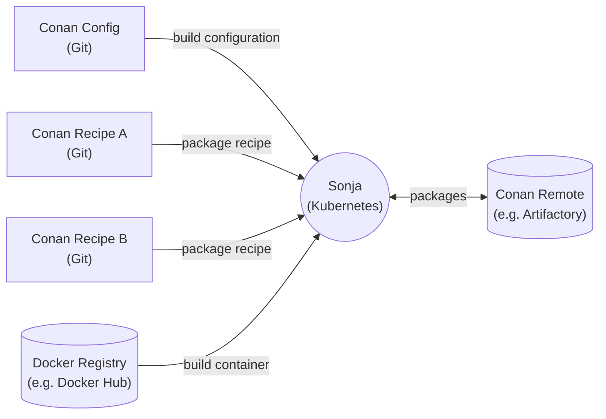

# Sonja

## A Conan CI

Sonja is a CI system to build Conan packages. In general Sonja works the same as
other CI systems like Jenkins, TeamCity, Bamboo etc. However, these systems have
a very general focus and are designed to cover a lot of different use cases. In
contrast, Sonja is designed with a very specific setting in mind:

- Sonja can only build Conan packages.
- Git is the only supported VCS. Conan package recipes must be stored
  in Git repositories to be processed by Sonja.
- Sonja runs builds inside Docker containers exclusively. No "build machines"
  (VMs or bare-metal) are supported.
- Sonja has to be hosted on a Kubernetes cluster. One component of the Sonja
  deployment is the "agent" service. The build capacity of a Sonja installation
  can be scaled by changing the number of deployments ("replicas") of the
  "agent" service.

Because Sonja "knows" that it builds Conan packages the process of setting up
new builds is very simple. The CI is also able to "understand" the build output
and can implement additional functionality on top of it:

- Different build configurations (x86, GCC, Linux, debug,...) are orthogonal to
  the builds (package A, package B). An additional build configuration (e.g. for
  the newest GCC version) can be added for all packages at once. To add a
  package, on the other hand, it is sufficient to provide a repo URL and,
  optionally, a path to the recipe inside the repo.
- Sonja parses the output of failed build. E.g. it "knows" about builds which
  failed because of a missing dependency. If the dependeny is built later it
  will automatically restart the failed build.

## Overview

## Features

- Web based UI
- Requires a separate [Conan remote](https://docs.conan.io/en/latest/uploading_packages/remotes.html) to store and retrieve Conan packages
- Builds packages in Linux or Windows (very experimental but works in principle)
  containers
- Can be configured to access private Git repositories (via SSH or HTTPS
  credentials)
- Can be configured to pull build container images from private Docker
  registries
- Automatically restarts failed builds if missing dependencies become
  available

## Try it

This repository contains a [Helm](https://helm.sh/) chart which installs the
latest version of Sonja on a Kubernetes cluster. More information is available
in [CHART.md](CHART.md).

The actual implementation of Sonja can be found in these two repositories:

- [Sonja Backend](https://github.com/uboot/sonja-backend)
- [Sonja Frontend](https://github.com/uboot/sonja-frontend)

## Feedback and Questions

Feel free to open issues in this repo for feedback and questions.
